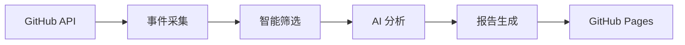

# TrendPulse

[](https://github.com/gqy20/TrendPluse/actions)
[](https://www.python.org/downloads/)
[](https://github.com/astral-sh/ruff)
[](https://codecov.io/gh/gqy20/TrendPluse)
[](https://home.gqy20.top/TrendPluse/)

## 概述

**TrendPulse** 是一个智能的 GitHub 趋势分析工具，专注于追踪 **Anthropic Claude 生态系统**的最新动态。

它使用 AI 自动分析 GitHub 活动，提取重要的技术趋势和创新点，并以结构化的报告展示。

### 核心特性

- 🔍 **智能采集**: 使用 GitHub API 实时获取 PR、Issue、Release
- 🤖 **AI 分析**: 使用 glm-4.7 提取趋势信号和关键洞察
- 📊 **每日报告**: 自动生成结构化的 Markdown 趋势分析报告
- 🎯 **多维分类**: 工程实践、研究成果、生态动向等分类
- 🌐 **自动发布**: GitHub Pages 自动展示报告
- ⚡ **TDD 开发**: 测试驱动开发，代码质量有保障

### 报告分类

| 分类 | 说明 | 示例 |
|------|------|------|
| 🔧 **工程信号** | Claude 工具链、SDK、框架更新 | 新增 API、性能优化、Bug 修复 |
| 🔬 **研究信号** | 论文、实验、技术探索 | 新模型、评估方法、基准测试 |

### 技术架构



## 快速开始

### 前置要求

- Python 3.13+
- [uv](https://github.com/astral-sh/uv) - 极速包管理器
- 智谱 AI API Key

### 安装

```bash
# 克隆仓库
git clone https://github.com/gqy20/TrendPluse.git
cd TrendPluse

# 安装依赖
uv sync --extra dev

# 配置环境变量
cp .env.example .env
# 编辑 .env 文件，填入 ANTHROPIC_API_KEY
```

### 配置

创建 `.env` 文件：

```bash
# 必需配置
ANTHROPIC_API_KEY=your_zhipu_api_key_here
ANTHROPIC_BASE_URL=https://open.bigmodel.cn/api/anthropic

# 可选配置（提高 GitHub API 速率限制）
GITHUB_TOKEN=your_github_token_here
```

### 获取 API Key

1. 访问 [智谱 AI 开放平台](https://open.bigmodel.cn/)
2. 注册/登录账号
3. 进入 API Keys 页面
4. 创建新的 API Key

### 运行

```bash
# 运行每日趋势分析
uv run python scripts/run.py

# 查看生成的报告
ls reports/
# report-2026-01-02.md
```

## 常用命令

### 代码检查

```bash
# 代码检查
make check
# 或: uv run ruff check .

# 代码格式化
make format
# 或: uv run ruff format .

# 类型检查
make typecheck
# 或: uv run mypy src/trendpluse

# 运行所有检查
make all
```

### 测试

```bash
# 运行测试
make test
# 或: uv run pytest

# 运行测试并生成覆盖率报告
make test-cov
# 或: uv run pytest --cov=src/trendpluse --cov-report=html
```

### 运行主程序

```bash
# 运行每日趋势分析
make run
# 或: uv run python scripts/run.py

# 生成报告索引
make gen-index
# 或: uv run python scripts/generate_report_index.py

# 同步仓库列表到文档
make sync-repos
# 或: uv run python scripts/sync_repos_to_docs.py
```

### 文档

```bash
# 构建文档
make docs
# 或: uv run mkdocs build

# 预览文档（本地）
make docs-serve
# 或: uv run mkdocs serve
```

## GitHub Actions

项目配置了两个自动化 workflow：

### 1. CI Workflow (`.github/workflows/ci.yml`)

**触发条件：** Push 到 main/develop 分支、Pull Request

**功能：**
- 代码检查 (ruff)
- 运行单元测试
- 上传覆盖率报告

### 2. Daily Analysis Workflow (`.github/workflows/daily-analysis.yml`)

**触发条件：**
- 每天 UTC 0:00（北京时间 8:00）自动运行
- 支持手动触发

**功能：**
- 运行单元测试
- 执行 GitHub 趋势分析
- 生成 Markdown 报告
- 同步报告到文档目录
- 提交报告到仓库

### 3. Deploy Pages Workflow (`.github/workflows/deploy-pages.yml`)

**触发条件：** 报告或文档更新

**功能：**
- 构建 MkDocs 文档站点
- 部署到 GitHub Pages

## 项目结构

```
TrendPluse/
├── .github/
│   └── workflows/          # GitHub Actions 配置
│       ├── ci.yml          # CI workflow
│       ├── daily-analysis.yml  # 每日分析
│       └── deploy-pages.yml    # Pages 部署
├── docs/                   # MkDocs 文档源文件
│   ├── index.md            # 首页
│   ├── features.md         # 功能概述
│   ├── quickstart.md       # 快速开始
│   ├── configuration.md    # 配置指南
│   ├── reports/            # 报告目录
│   │   └── index.md        # 报告索引
│   └── stylesheets/        # 自定义样式
├── reports/                # 生成的趋势报告
│   └── report-*.md
├── scripts/                # 工具脚本
│   ├── run.py              # 主程序入口
│   ├── generate_report_index.py  # 生成报告索引
│   ├── sync_repos_to_docs.py     # 同步仓库列表到文档
│   ├── repos_doc_generator.py    # 仓库文档生成器
│   └── check.py            # 健康检查脚本
├── src/trendpluse/         # 源代码
│   ├── analyzers/          # AI 分析器
│   ├── collectors/         # 数据采集器
│   ├── models/             # 数据模型
│   ├── reporters/          # 报告生成器
│   ├── config/             # 配置模块
│   ├── reports/            # 报告存储
│   ├── config.py           # 配置管理（主入口）
│   ├── pipeline.py         # 主流程
│   ├── logger.py           # 日志系统
│   ├── core.py             # 核心基础函数
│   ├── api.py              # API 接口定义
│   └── main.py             # 命令行入口
├── tests/                  # 测试文件
│   └── unit/
├── mkdocs.yml              # MkDocs 配置
├── pyproject.toml          # 项目配置
└── README.md               # 本文件
```

## 报告展示

每日生成的报告会自动发布到 GitHub Pages：

👉 **[查看在线报告](https://home.gqy20.top/TrendPluse/)**

报告包含：
- 📊 当日趋势总览
- 🔧 工程信号详情
- 🔬 研究信号详情
- 📈 统计信息

## 开发指南

### 代码规范

1. **语言**：注释和文档使用**中文**
2. **命名**：函数和类使用英文
3. **类型注解**：必需
4. **文档字符串**：Google 风格中文文档
5. **提交规范**：feat/fix/docs/refactor/test/chore

### TDD 开发流程

```bash
# 1. 编写测试
vim tests/unit/test_feature.py

# 2. 运行测试（失败）
make test tests/unit/test_feature.py

# 3. 实现功能
vim src/trendpluse/feature.py

# 4. 运行测试（通过）
make test tests/unit/test_feature.py

# 5. 代码检查
make check
make format

# 6. 提交
git add .
git commit -m "feat: add new feature"
```

## 支持的仓库

默认追踪以下仓库：

### Anthropic 官方

#### 核心产品
- `anthropics/claude-code` - Claude Code 编程助手
- `anthropics/skills` - Claude Agent 技能库
- `anthropics/claude-cookbooks` - Claude 食谱示例
- `anthropics/claude-quickstarts` - Claude 快速开始示例
- `anthropics/courses` - Claude 课程
- `anthropics/prompt-eng-interactive-tutorial` - Prompt 工程交互教程

#### SDK & Agent
- `anthropics/claude-agent-sdk-python` - Claude Agent SDK (Python)
- `anthropics/claude-agent-sdk-typescript` - Claude Agent SDK (TypeScript)
- `anthropics/claude-agent-sdk-demos` - Claude Agent SDK 示例
- `anthropics/anthropic-sdk-python` - Anthropic SDK (Python)
- `anthropics/anthropic-sdk-typescript` - Anthropic SDK (TypeScript)
- `anthropics/anthropic-sdk-go` - Anthropic SDK (Go)
- `anthropics/anthropic-sdk-java` - Anthropic SDK (Java)

#### 工具与集成
- `anthropics/claude-code-action` - Claude Code GitHub Action
- `anthropics/claude-code-security-review` - Claude Code 安全审查
- `anthropics/claude-plugins-official` - Claude 官方插件
- `anthropics/devcontainer-features` - DevContainer 特性

#### 研究与评估
- `anthropics/evals` - Anthropic 评估工具
- `anthropics/political-neutrality-eval` - 政治中立性评估
- `anthropics/hh-rlhf` - HH-RLHF 研究

### AI 编程助手
- `cline/cline` - Autonomous coding agent
- `paul-gauthier/aider` - AI pair programming tool
- `continuedev/continue` - AI code assistant

### AI 工具
- `openai/openai-python` - OpenAI Python SDK
- `openai/openai-quickstart-python` - OpenAI Quickstart
- `danielmiessler/fabric` - AI 工作流工具
- `ErikBjare/gptme` - AI 终端助手

### Agent 框架
- `langchain-ai/langchain` - LangChain 框架
- `langgenius/dify` - Dify LLM 应用开发平台
- `run-llama/llama_index` - LlamaIndex 数据框架
- `microsoft/autogen` - Microsoft AutoGen
- `TransformerOptimus/SuperAGI` - SuperAGI 框架
- `Significant-Gravitas/AutoGPT` - AutoGPT
- `OpenDevin/OpenDevin` - OpenDevin
- `google-gemini/gemini-cli` - Gemini CLI 工具
- `agentscope-ai/agentscope` - AgentScope 框架
- `agno-agi/agno` - 多代理框架

可在 `src/trendpluse/config.py` 中添加更多仓库。

## 故障排查

### 分析失败

**问题**: 运行 `scripts/run.py` 失败

**解决方案**:
```bash
# 检查环境变量
echo $ANTHROPIC_API_KEY
echo $ANTHROPIC_BASE_URL

# 查看详细日志
RUST_LOG=debug uv run python scripts/run.py
```

### 没有生成报告

**问题**: `reports/` 目录为空

**可能原因**:
- 当日没有符合条件的 PR
- GitHub API 速率限制
- 网络连接问题

**解决方案**:
- 使用 GitHub Token 提高速率限制
- 检查网络连接
- 查看日志输出

### GitHub Actions 失败

**问题**: Workflow 运行失败

**解决方案**:
```bash
# 查看 workflow 运行日志
gh run list
gh run view <run_id> --log-failed

# 检查 secrets 配置
gh secret list
```

## 贡献指南

欢迎贡献！请遵循以下步骤：

1. Fork 本仓库
2. 创建特性分支 (`git checkout -b feature/AmazingFeature`)
3. 提交更改 (`git commit -m 'feat: add AmazingFeature'`)
4. 推送到分支 (`git push origin feature/AmazingFeature`)
5. 开启 Pull Request

## 许可证

MIT License

Copyright © 2026 gqy20

---

**[项目文档](https://home.gqy20.top/TrendPluse/)** | **[在线报告](https://home.gqy20.top/TrendPluse/reports/)** | **[GitHub 仓库](https://github.com/gqy20/TrendPluse)**
