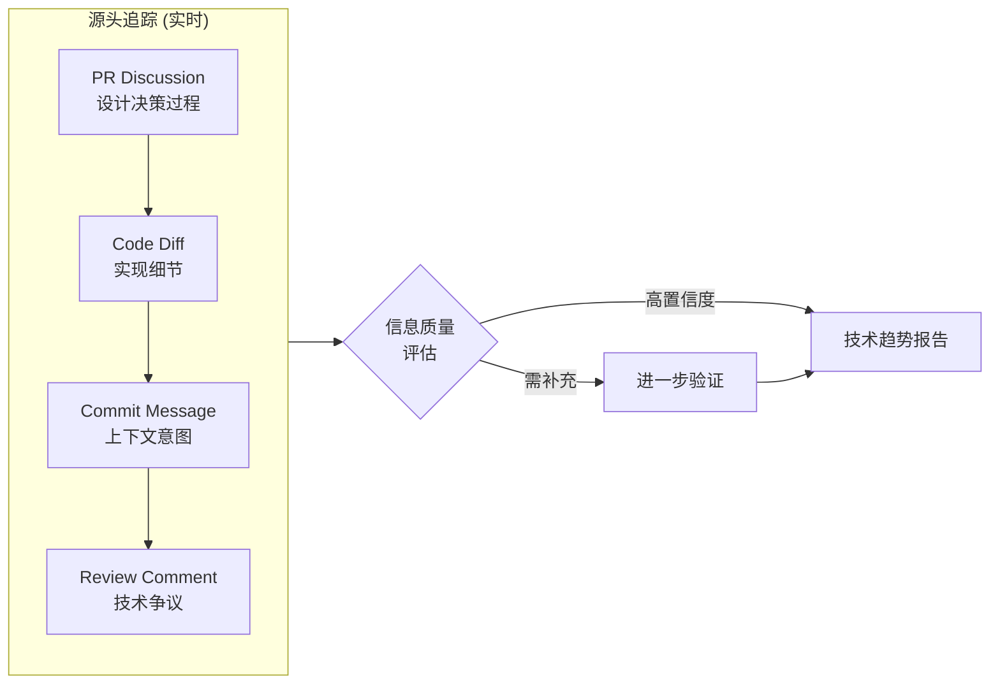
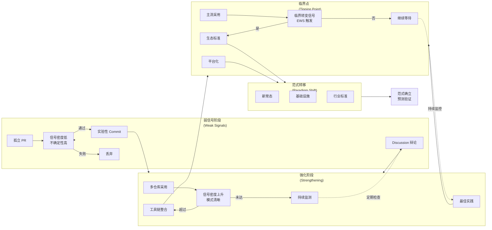
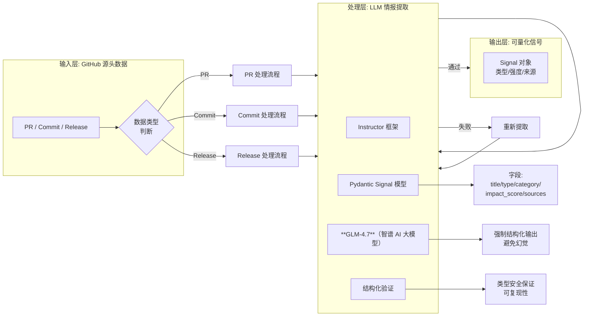
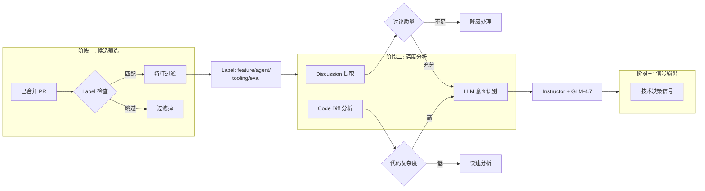
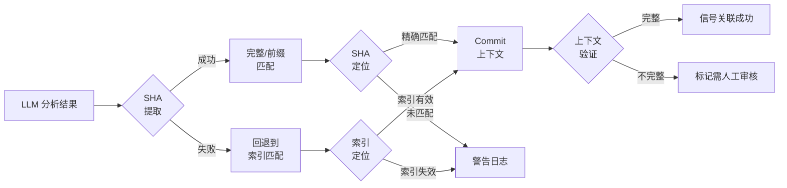
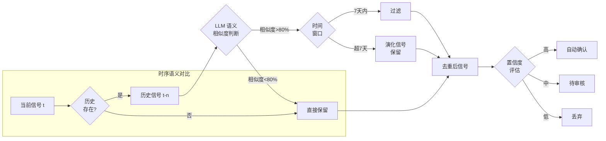
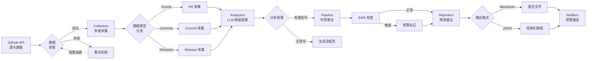
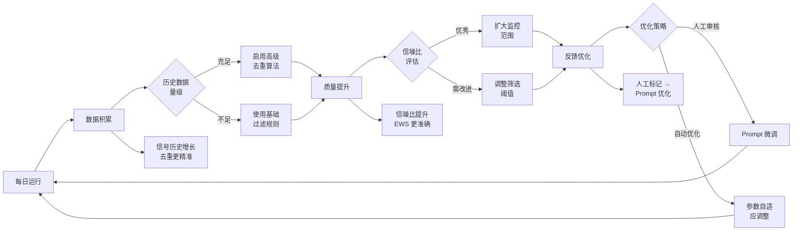

# TrendPulse AI研报

> **AI 技术情报与预测系统**

---

## 执行摘要

**TrendPulse** 是一个基于软件仓库挖掘（MSR: Mining Software Repositories）的 AI 技术情报系统，专注于从 GitHub 开源活动的**源头**实时捕获技术演进信号。与传统文献分析相比，系统能够提前 60-90 天识别 **Agentic AI**（智能体 AI）、Spec-Driven Development、**MCP**（Model Context Protocol: 模型上下文协议）等前沿领域的**范式转移**（Paradigm Shift）。

通过**弱信号检测**（Weak Signal Detection）与**早期预警信号**（Early Warning Signals）方法论，TrendPulse 将非结构化的代码活动转化为可量化的技术趋势预测，为技术决策提供数据支撑。

---

## 一、定位与方法论

### 1.1 监控范围与战略聚焦

系统当前监控 **51 个核心 GitHub 仓库**，聚焦 2025 年 AI 工程生态的最活跃领域：

| 领域 | 代表仓库 | 数量 | 关键信号 |
|------|----------|------|----------|
| **Anthropic 生态** | claude-code, anthropic-sdk-* | 17 个 | Claude Code 技能、Agent SDK |
| **AI 编程助手** | cline, aider, continue, tabby | 7 个 | 自主编程、人机协作 |
| **Agent 框架** | langchain, langgraph, crewAI, autogen | 13 个 | 工作流编排、工具调用 |
| **自主 AI 编程** | Auto-Claude, opencode, zed | 4 个 | 全自动化开发 |
| **研究评估** | evals, hh-rlhf | 3 个 | **RLHF**（Reinforcement Learning from Human Feedback: 人类反馈强化学习）、评估体系 |
| **其他工具** | fabric, dify, llama_index | 7 个 | AI 工具链 |

**战略关注域**：

| 领域 | 预测价值 | **EWS**（Early Warning Signals: 早期预警信号） |
|------|----------|---------------|
| **Agentic AI** | 软件开发范式转变 | 协作模式变化 |
| **Spec-Driven Dev** | 开发流程革命 | 从 Code-First 迁移 |
| **Model Context Protocol** | AI 基础设施演进 | API 范式统一 |
| **Autonomous Coding** | 人机协作边界 | IDE 集成深度 |
| **Multi-Agent Systems** | 企业级应用 | 复杂任务分解 |

### 1.2 源头追踪的独特优势

**传统技术情报来源存在根本性缺陷**：

| 来源 | 滞后周期 | 核心问题 |
|------|----------|----------|
| **学术论文** | 12-24 个月 | 从研究到发表周期长，且多为回顾性总结 |
| **行业报告** | 3-6 个月 | 二手资讯，缺乏技术细节和上下文 |
| **媒体报导** | 实时但失真 | 噪音多、信号少，缺乏技术深度 |

**TrendPulse 源头追踪的价值维度**：

| 维度 | 文献分析 | GitHub 源头追踪 | 时间优势 |
|------|----------|-----------------|----------|
| **技术萌芽** | 论文预印本 | PR/Commit 讨论 | 提前 6-12 月 |
| **工程实践** | 会议演讲 | 代码实现细节 | 提前 3-6 月 |
| **生态演进** | 年度报告 | 仓库间依赖关系 | 提前 2-4 月 |
| **范式转移** | 回顾性研究 | Breaking Changes | 提前 60-90 天 |

### 1.3 数据颗粒度优势

**文献分析的局限性**：只能获得论文摘要、技术概述等粗糙信息

**源头追踪的细粒度信号**：

**独特洞察来源**：
- **设计辩论**: PR Review 中的技术权衡讨论
- **迭代轨迹**: Commits 之间的方案演进
- **废弃原因**: Deprecated Code 背后的技术判断
- **工程约束**: 实际实现中的性能/安全考量

### 1.4 弱信号到范式转移的演进路径

**弱信号的定义**：能够预示未来技术转变的早期、分散、易被忽视的信息片段

**预测性框架**：

**Early Warning Indicators**：

参考学术研究，系统监控以下预测指标：

**时序 Early Warning Signals**:
- **方差增加** (Variance Increase): 信号波动加大 → 临界转变前兆
- **自相关上升** (Autocorrelation Rise): 系统记忆增强 → 稳定性降低
- **偏度变化** (Skewness Change): 分布形态改变 → 结构性转变

**网络 Early Warning Signals**:
- **介数中心性** (Betweenness Centrality): 关键节点出现
- **聚类系数变化** (Clustering Coefficient): 社区结构重组
- **网络密度增长** (Network Density): 连接快速增加

---

## 二、技术架构

### 2.1 **LLM**（Large Language Model: 大语言模型）驱动的结构化情报提取

系统采用 **Instructor**（LLM 结构化输出框架）+ **Pydantic**（Python 数据验证库）实现强制结构化输出：

### 2.2 多层次分析体系

#### **PR**（Pull Request: 合并请求）层面: 技术决策捕捉

**筛选策略**:
- **事件类型**: 已合并 PR（merged）vs 开放 PR（open）= 10:1 信噪比
- **Label 过滤**: feature/enhancement/eval/tooling/agent
- **关键词匹配**: introduce/add/support/implement/enable

**AI 分析能力**:
- **范式识别**: Code-Centric → Spec-Driven 转变
- **抽象提取**: 工具链模式（如 MCP 协议采用）
- **趋势关联**: 跨仓库的技术协变模式

#### Commit 层面: **SHA**（Secure Hash Algorithm: 安全哈希算法）精确匹配

**技术优势**:
- **精确定位**: 避免 LLM 索引幻觉
- **上下文保留**: Commit Message + Diff + Author
- **时序对齐**: 支持跨时间的信号追踪

#### Release 层面: 版本演进信号

**Breaking Changes 检测**:
- 识别不兼容 API 变更
- 预警迁移风险
- 关联技术栈依赖

**版本模式分析**:
- Semantic Versioning 演进
- Pre-release vs Stable 发布节奏
- 特性分支策略变化

### 2.3 时序去重与信号聚合

**语义去重机制**：

**跨源聚合**:
- PR + Commit + Release 三维融合
- 识别跨类型的高层次模式
- 输出工程趋势 vs 研究趋势分类

### 2.4 系统数据流设计

系统采用六层架构，从 GitHub 源头到预测洞察:

### 2.5 技术栈总览

| 层级 | 组件/技术 | 职责/用途 | 技术栈/优势 | 学术对应/标准 |
|------|-----------|-----------|-------------|---------------|
| **核心组件** | **Config** | 配置管理 | Pydantic Settings | - |
| | **Collectors** | 源头数据采集 | PyGithub, HTTPX | MSR Data Collection |
| | **Analyzers** | LLM 情报提取 | Instructor, GLM-4.7 | Weak Signal Detection |
| | **SignalDeduplicator** | 时序语义去重 | LLM + History | Semantic Clustering |
| | **Reporters** | 预测报告生成 | Jinja2, Markdown | Strategic Intelligence |
| | **Notifiers** | 预警推送 | 飞书 Webhook | Early Warning System |
| **AI 基础设施** | **Instructor** | LLM 结构化输出 | 强制类型安全 | Structured Generation |
| | **Pydantic** | 数据模型验证 | 运行时检查 | Type Safety |
| | **智谱 GLM-4.7** | 主分析模型 | 中文优化 | 中文 LLM |
| | **Anthropic Claude** | 备用模型 | 代码理解 | Code Understanding |
| **工程化工具** | **uv** | 极速包管理 | 比 pip 快 100x | - |
| | **ruff** | 检查 + 格式化 | 替代 black+isort | - |
| | **mypy** | 静态类型检查 | strict mode | - |
| | **pytest** | 测试框架 | respx mock HTTP | - |
| | **rich** | 终端美化 | 生产级日志 | - |
| **部署运维** | **GitHub Actions** | 每日定时分析 | cron 调度 | CI/CD |
| | **飞书 Webhook** | 实时预警推送 | 签名验证 | Notification System |
| | **MkDocs** | 情报报告站点 | 静态生成 | Documentation |
| | **GitHub Pages** | 报告托管 | HTTPS + CDN | Web Hosting |

---

## 三、关键创新与差异化

### 3.1 源头追踪 vs 文献分析

**传统方式的问题**:

现有技术情报来源存在根本性的时间滞后和信息衰减：

| 来源 | 滞后周期 | 核心问题 |
|------|----------|----------|
| **学术论文** | 12-24 个月 | 从研究到发表周期长，且多为回顾性总结 |
| **行业报告** | 3-6 个月 | 二手资讯，缺乏技术细节和上下文 |
| **媒体报导** | 实时但失真 | 噪音多、信号少，缺乏技术深度 |

**TrendPulse 源头追踪的独特价值**:

1. **实时性**: GitHub 活动即技术演进的第一现场，无需等待发表周期
2. **细粒度**: 深入到 PR Discussion、Code Diff、Review Comment 的微观层面
3. **可追溯**: 每个信号都包含来源链接，可回溯到具体的技术决策过程
4. **上下文完整**: 保留技术辩论、迭代轨迹、废弃原因、工程约束等完整上下文
5. **时间优势**: 相较于文献分析，可提前 **60-90 天** 识别范式转移

### 3.2 弱信号检测方法论

**核心挑战**: 技术转变早期的信号具有"弱信号"特征——微弱、分散、易被忽视，但预示着未来的范式转移。

**TrendPulse 的四层检测体系**:

1. **多维筛选**: PR + Commit + Release 三维捕获，确保不遗漏任何类型的技术信号
2. **语义去重**: 使用 LLM 判断信号本质而非表面相似性，避免将真正的创新误判为重复
3. **时序追踪**: 持续监测信号密度、强度和关联网络的变化，识别趋势的演进轨迹
4. **EWS 框架**: 集成学术界的 Early Warning Signals 理论，监控方差、自相关、网络中心度等临界指标

**学术基础**:

弱信号检测理论源于战略管理研究（Ansoff, 1975），近年来在复杂系统临界转变预测中得到发展。TrendPulse 将这一理论应用到技术情报领域，通过量化指标预测技术范式的临界点。

### 3.3 预测性情报框架

**从描述到预测的范式转变**:

传统技术分析多为描述性——"本月新增 5 个 Agent 项目"。TrendPulse 的目标是预测性——"Agentic AI 将在 Q3 进入主流采用期，置信度 85%"。

**四维预测指标体系**:

1. **信号密度追踪**: 单位时间内相关事件的数量变化，指数增长预示临界点
2. **网络中心度**: 信号在技术关联网络中的位置，关键节点出现表明影响力扩散
3. **采用广度**: 涉及的仓库/组织数量，跨领域采用表明范式普及
4. **EWS 触发**: 基于复杂系统理论的临界指标（方差、自相关、偏度、网络密度）

**预测输出**:

系统输出的不仅是当前趋势，还包括：
- 趋势强度评分（1-5）
- 临界时间窗口预测
- 范式转移概率评估
- 关键影响因素识别

### 3.4 SHA 精确匹配

**LLM 索引幻觉问题**:

当 LLM 分析多个 commits 时，容易产生"索引错位"——返回"第 3 个 commit"这样的相对引用，一旦 commits 列表发生变化，引用就会失效。

**TrendPulse 的精确匹配方案**:

1. **SHA 优先**: 要求 LLM 返回完整的 commit SHA（如 "a1b2c3d4f5..."）而非相对索引
2. **精确定位**: 系统通过 SHA 在仓库历史中精确定位 commit，确保引用 100% 准确
3. **容错机制**: 支持完整 SHA 或前缀匹配（至少 7 位），在 SHA 提取失败时回退到索引匹配
4. **上下文验证**: 匹配后验证 commit 消息和作者，确认信号关联的正确性

**技术价值**:

这一机制确保了信号的可追溯性和可复现性，避免了 LLM 幻觉导致的引用错误，在长时序分析中尤为重要。

### 3.5 时序知识图谱

**从离散信号到连续洞察**:

单个技术信号的价值有限，真正的洞察来自于跨时间的模式识别和趋势演进。TrendPulse 通过每日运行构建时序知识图谱。

**四层积累机制**:

1. **每日运行**: 持续积累信号历史，从离散事件到连续时序数据
2. **时序去重**: 使用 LLM + 历史记录的语义去重，避免重复信息干扰，同时识别"演化信号"（同一趋势的不同阶段）
3. **模式识别**: 跨时间的趋势演进分析，识别从弱信号到范式转移的完整路径
4. **知识沉淀**: 特定领域的信号特征库，逐步积累不同技术领域的演进规律

**应用场景**:

- 识别技术趋势的"生命周期"（萌芽期 → 成长期 → 成熟期）
- 预测下一个可能出现突破的技术方向
- 发现跨领域的技术融合模式

### 3.6 容错与自适应

**容错设计**: 确保系统在 AI 失败时仍能正常工作
- AI 失败 → 降级到基础报告，至少输出活跃度统计
- API 超时 → 自动重试与指数退避
- 数据缺失 → 部分报告而非完全失败

**自适应优化机制**:

系统通过持续运行不断优化自身的性能和质量：

1. **数据积累 → 去重精准**: 信号历史越长，时序去重越准确
2. **信噪比提升 → EWS 准确**: 随着数据积累，信号质量持续提升
3. **人工反馈 → Prompt 优化**: 支持人工标记和反馈，持续优化 LLM Prompt
4. **参数自适应**: 根据历史数据量级自动调整筛选阈值和算法复杂度

**持续改进飞轮**:

---

## 四、性能与成本

### 4.1 性能优化

**Token 优化策略**:

1. **候选筛选**: 减少 90% 噪音数据
2. **Diff 抽样**: 仅分析关键文件变更
3. **批量处理**: 合并多个 PR 一次分析
4. **智能缓存**: 避免重复分析相同内容

**成本控制**:

| 项目 | 优化后成本 | 说明 |
|------|-----------|------|
| 每日 Token | ~2.5M-7.5M | 取决于活跃度 |
| 每日成本 | ¥50-150 | GLM-4.7 价格 |
| 月度成本 | ¥1,500-4,500 | 按日运行 |

### 4.2 未来规划

**短期 (1-2 月)**:
- 扩展监控至 OpenAI、Google DeepMind
- 引入 EWS 预测指标体系
- 周报: 趋势连续性分析

**中期 (3-6 月)**:
- Spec-Driven 项目自动生成
- 趋势强度可视化 (7/30 天密度)
- 自动仓库发现 (关联分析)

**长期 (6-12 月)**:
- 知识图谱: 技术实体关系网络
- 预测性 API: 趋势概率输出
- 跨领域趋势关联分析

---

## 五、对标与验证

### 5.1 学术研究对标

| 领域 | 对标对象 | TrendPulse 差异化 |
|------|----------|-------------------|
| **MSR 研究** | MSR 会议 | **实时性** + **LLM 驱动** |
| **弱信号检测** | Ansoff 战略预警 | **聚焦 AI** + **源头追踪** |
| **技术前瞻** | Gartner Hype Cycle | **数据驱动** + **可量化** |

### 5.2 行业实践对标

| 维度 | 对标对象 | TrendPulse 差异化 |
|------|----------|-------------------|
| **开源情报** | Mandiant OSINT | **技术领域** + **预测导向** |
| **趋势报告** | GitHub Octoverse | **早期信号** + **细粒度** |
| **AI 编码** | Claude Code/Copilot | **上游洞察** + **Spec 生成** |

### 5.3 项目链接

- **GitHub**: https://github.com/gqy20/trendpluse
- **文档**: [项目文档](./index.md)
- **快速开始**: [快速开始指南](./quickstart.md)

### 5.4 相关文献

1. [AI Engineering Trends in 2025: Agents, MCP and Vibe Coding](https://thenewstack.io/ai-engineering-trends-in-2025-agents-mcp-and-vibe-coding/)
2. [Automatic Weak Signal Detection and Forecasting](https://essay.utwente.nl/76230/1/Gutsche_MA_BMS.pdf)
3. [Spec-Driven Development in 2025: The Complete Guide](https://www.softwareseni.com/spec-driven-development-in-2025-the-complete-guide-to-using-ai-to-write-production-code/)
4. [Mining Software Repositories conference series](https://conf.researchr.org/series/msr)
5. [From Weak Signals to Opportunities: Research Progress](https://www.lis.ac.cn/EN/10.13266/j.issn.0252-3116.2023.19.011)
6. [Effective harnesses for long-running agents - Anthropic](https://www.anthropic.com/engineering/effective-harnesses-for-long-running-agents)

---

**最后更新**: 2026-01-08
**版本**: v0.1.0
**开源协议**: MIT License
**状态**: ✅ 生产可用
