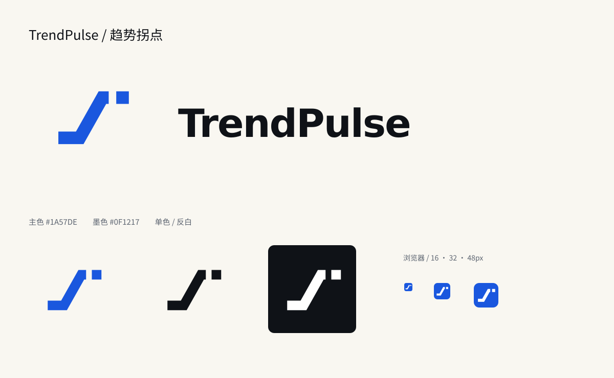

# TrendPulse 品牌标志

正式采用方案 A「趋势拐点」。连续折线表示趋势演进，独立方形节点表示被识别出的新信号。主标志的几何结构与黑白方案稿一致。

## 资产

| 用途 | 文件 |
| --- | --- |
| 网站导航、常规横向组合 | `../../../web/public/assets/brand/logo.svg` |
| 单色横向组合 | `../../../web/public/assets/brand/logo-black.svg` |
| 深色背景反白组合 | `../../../web/public/assets/brand/logo-white.svg` |
| 独立符号 | `../../../web/public/assets/brand/mark.svg` |
| 黑色 / 白色符号 | `../../../web/public/assets/brand/mark-black.svg`、`mark-white.svg` |
| 横向 PNG | `../../../web/public/assets/brand/logo.png` |
| 浏览器图标 | `../../../web/public/favicon.svg`、`favicon.ico` |
| PNG 图标 | `../../../web/public/assets/brand/icon-{16,32,48,192,512}.png` |
| Apple Touch Icon | `../../../web/public/apple-touch-icon.png` |
| 安装图标配置 | `../../../web/public/site.webmanifest` |

SVG 横向组合中的字标已转为路径，不依赖客户端字体。字标基于 DejaVu Sans Bold 的轮廓，并调整了字距。横向组合中的图形相对初版缩小 18%，字标尺寸保持不变。图形符号为本项目原创几何设计。

## 使用规则

- 主蓝色 `#1A57DE`，墨色 `#0F1217`；白色版仅放在足够深的背景上。
- 按整体比例缩放。不要单独改变方形节点的位置或大小，也不要拉伸、旋转、增加描边和阴影。
- 标志四周至少保留一个方形节点边长的净空；导航组合已包含图形与文字之间的间隔。
- 独立图形最低 16px；导航组合建议不小于 176px 宽。更小的场景使用独立符号。
- favicon 与移动图标使用蓝底白色符号，以保证深浅浏览器界面中的辨识度。
- `docs/design/logo-concepts/` 保留方案探索记录。正式使用以本目录和 `web/public/assets/brand/` 的资产为准。

## 接入位置

全站导航、全站页脚、SVG/PNG/ICO favicon、Apple Touch Icon、Web Manifest、项目 README。

旧地址 `web/public/assets/bolt.svg` 保留为兼容入口，内容已更新为 A 标志，供已有浏览器缓存或旧链接加载；新页面统一引用 `assets/brand/`。

