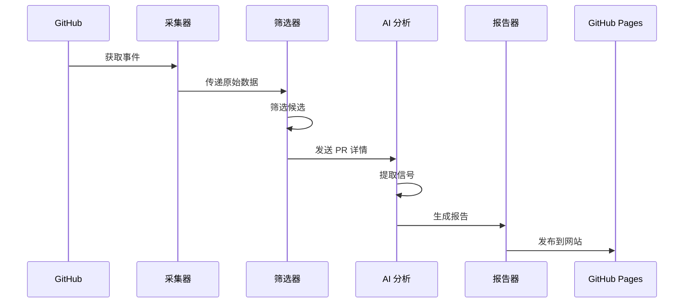

# 功能概述

TrendPulse 是一个自动化趋势分析工具，专注于 Anthropic Claude 生态系统的动态追踪。

## 核心特性

### 1. 智能事件采集

- 🔍 **GitHub API 集成**: 实时获取 PR、Issue、Release
- 🎯 **智能筛选**: 过滤高价值活动
- 📅 **定时采集**: 每日自动更新数据

### 2. AI 驱动分析

- 🤖 **GLM-4 模型**: 使用智谱 AI 进行深度分析
- 📊 **信号提取**: 自动识别技术趋势和创新点
- 🏷️ **智能分类**: 工程、研究、生态等多维度分类

### 3. 结构化报告

- 📝 **Markdown 格式**: 易读、易分享
- 🎨 **美观展示**: GitHub Pages 自动发布
- 🔍 **全文搜索**: 快速找到历史信息

## 数据流程

## 支持的仓库

默认追踪以下仓库的动态：

- `anthropics/anthropic-sdk-python`
- `anthropics/claude-quickstarts`
- `anthropics/skills`
- `anthropics/claude-cookbook`

可在配置文件中添加更多仓库。

## 报告内容

每份报告包含：

- 📊 **当日总览**: 简洁的摘要说明
- 🔧 **工程信号**: 工具链更新、API 变更
- 🔬 **研究信号**: 论文、实验、探索
- 📈 **统计数据**: 分析数量、影响评分

## 技术栈

| 组件 | 技术 |
|------|------|
| 语言 | Python 3.13+ |
| 包管理 | uv |
| AI 模型 | 智谱 GLM-4 |
| API | GitHub REST API |
| 部署 | GitHub Actions |
| 展示 | MkDocs + Material |
