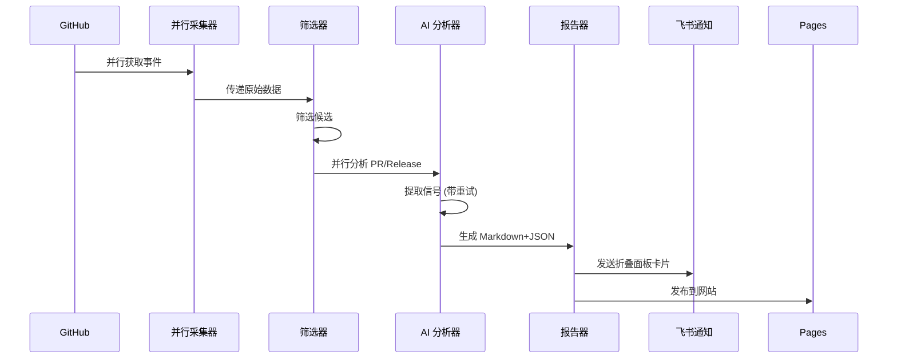

# 功能概述

TrendPulse 是一个自动化趋势分析工具，专注于 Anthropic Claude 生态系统的动态追踪。

## 核心特性

### 1. 智能事件采集

- 🔍 **GitHub API 集成**: 实时获取 PR、Issue、Release
- 🎯 **智能筛选**: 过滤高价值活动
- 📅 **定时采集**: 每日自动更新数据
- 📦 **Release 监控**: 自动追踪版本发布，分析升级趋势
- 💾 **Commit 分析**: 从代码提交中提取技术信号
- 📈 **仓库活跃度**: 追踪 commit 数量、活跃仓库、新贡献者

### 2. AI 驱动分析

- 🤖 **GLM-4 模型**: 使用智谱 AI 进行深度分析
- 📊 **信号提取**: 自动识别技术趋势和创新点
- 🏷️ **智能分类**: 工程、研究、生态等多维度分类
- 🔄 **智能去重**: 基于 LLM 的信号去重机制
- 🔍 **Breaking Changes 检测**: AI 检测版本不兼容变更
- 🚀 **Release AI 总结**: 使用 AI 分析 Release Notes，生成结构化中文总结

### 3. 结构化报告

- 📝 **Markdown 格式**: 易读、易分享
- 📄 **JSON 格式**: 机器可读，支持数据分析和 API
- 🎨 **美观展示**: GitHub Pages 自动发布
- 🔍 **全文搜索**: 快速找到历史信息
- 📬 **飞书通知**: 支持 @ 提醒和富文本卡片
- 📱 **折叠面板**: 飞书卡片使用折叠面板优化信息展示
- 🔄 **自动重试**: LLM 调用失败自动重试（指数退避）

### 4. 并行处理

- ⚡ **并行采集**: 使用线程池并行调用 GitHub API
- ⚡ **并行分析**: PR 和 Release 分析并行处理
- 🛡️ **容错设计**: 单个任务失败不影响整体流程

## 数据流程

```mermaid
sequenceDiagram
    participant GH as GitHub
    participant Collector as 并行采集器
    participant Filter as 筛选器
    participant AI as AI 分析器
    participant Reporter as 报告器
    participant Feishu as 飞书通知

    GH->>Collector: 并行获取事件
    Collector->>Filter: 传递原始数据
    Filter->>Filter: 筛选候选
    Filter->>AI: 并行分析 PR/Release
    AI->>AI: 提取信号 (带重试)
    AI->>Reporter: 生成 Markdown+JSON
    Reporter->>Feishu: 发送折叠面板卡片
    Reporter->>Pages: 发布到网站
```

## 支持的仓库

默认追踪以下仓库的动态：

- `anthropics/anthropic-sdk-python`
- `anthropics/claude-quickstarts`
- `anthropics/skills`
- `anthropics/claude-cookbook`

支持 50+ AI 编程工具和 Agent 框架仓库，可在配置文件中添加更多仓库。

## 报告内容

每份报告包含：

- 📊 **当日总览**: 简洁的摘要说明
- 🔧 **工程信号**: 工具链更新、API 变更（折叠面板）
- 🔬 **研究信号**: 论文、实验、探索（折叠面板）
- 💾 **Commit 信号**: 从代码提交中提取的技术信号
- 🎯 **Release 信号**: 版本发布信号分析
- 🚀 **版本发布**: 最新版本发布信息（带 AI 总结）
- ⚠️ **Breaking Changes**: 不兼容变更检测
- 📈 **仓库活跃度**: Commit 数量、活跃仓库排名
- 📊 **统计数据**: 分析数量、影响评分
- 🔗 **JSON 数据**: 完整的结构化数据

## 技术栈

| 组件 | 技术 |
|------|------|
| 语言 | Python 3.13+ |
| 包管理 | uv |
| AI 模型 | 智谱 GLM-4 |
| 并行处理 | ThreadPoolExecutor |
| 重试机制 | tenacity |
| API | GitHub REST API |
| 部署 | GitHub Actions |
| 展示 | MkDocs + Material |
| 通知 | 飞书 Webhook |

## 新增功能详解

### Release AI 总结

使用 `ReleaseSummarizer` 分析 Release Notes，生成结构化中文总结：

- **变更类型**: feature/fix/improvement/breaking/other
- **关键变更**: 3-5 个简洁的中文描述
- **中文总结**: 2-3 句话概括主要变更
- **影响级别**: 1-5 级评分

### 并行处理架构

- **采集并行**: `parallel_map()` 和 `parallel_execute()` 函数
- **分析并行**: `TrendAnalyzer` 和 `ReleaseSummarizer` 支持多线程
- **容错设计**: 单个任务失败自动降级，不影响整体流程

### 飞书通知优化

- **折叠面板**: 工程/研究信号、版本发布、活跃度统计使用折叠面板
- **智能去重**: 摘要中移除重复的日期信息
- **链接格式化**: Commit SHA、PR 号码自动格式化

### LLM 调用重试机制

使用 `tenacity` 库实现自动重试：

- **重试条件**: 超时、速率限制等临时错误
- **重试策略**: 最多 3 次，指数退避（1s → 2s → 4s → 10s）
- **失败降级**: 重试耗尽后返回默认值，确保流程继续
