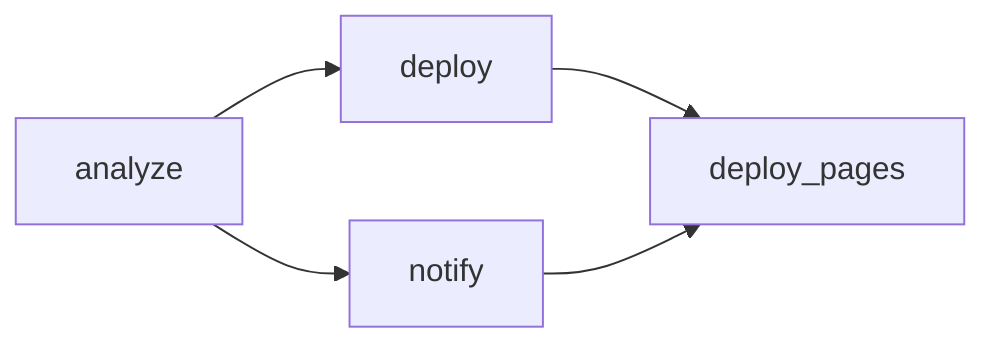

# GitHub Actions 配置指南

## Workflow 文件

### 1. CI Workflow (`.github/workflows/ci.yml`)

**触发条件：**
- Push 到 `main` 分支
- Pull Request 到 `main` 分支

**功能：**
- 代码检查 (ruff check & format)
- 类型检查 (mypy)
- 运行单元测试
- 上传覆盖率报告到 Codecov

---

### 2. 每日分析 Workflow (`.github/workflows/run-daily.yml`)

**触发条件：**
- 每天 UTC 0:10 (北京时间 8:10)
- 手动触发 (workflow_dispatch)

**功能：**
- 运行 TrendPulse 趋势分析
- 生成 Markdown + JSON 报告
- 上传报告为 artifact (保留 30 天)
- 自动提交报告到仓库 ([skip ci] 跳过 CI)
- 同步报告索引到文档
- 部署到 GitHub Pages
- 可选发送飞书通知

**Job 结构：**


---

### 3. 飞书通知 Workflow (`.github/workflows/send-feishu.yml`)

**触发条件：**
- 手动触发 (workflow_dispatch)
- 支持指定报告日期

**功能：**
- 下载指定日期的报告
- 生成飞书卡片（折叠面板格式）
- 发送到飞书群机器人
- 上传飞书卡片为 artifact

---

### 4. 仓库请求处理 Workflow (`.github/workflows/process_repo_request.yml`)

**触发条件：**
- Issue 中包含特定标签

**功能：**
- 自动处理仓库添加请求
- 更新监控仓库列表

---

### 5. Pages 部署 Workflow (`.github/workflows/deploy-pages.yml`)

**触发条件：**
- `run-daily.yml` 完成后触发

**功能：**
- 构建 MkDocs 文档
- 部署到 GitHub Pages

---

## 配置 Secrets

在 GitHub 仓库中配置以下 Secrets：

### 必需配置

| Secret 名称 | 说明 | 获取方式 |
|------------|------|----------|
| `ANTHROPIC_API_KEY` | 智谱 AI API Key | https://open.bigmodel.cn/usercenter/apikeys |

### 可选配置

| Secret 名称 | 说明 | 默认值 |
|------------|------|--------|
| `ANTHROPIC_BASE_URL` | API 基础 URL | `https://open.bigmodel.cn/api/anthropic` |
| `GITHUB_TOKEN` | GitHub Token | 自动提供 |
| `FEISHU_WEBHOOK_URL` | 飞书 Webhook URL | 无（不发送通知） |
| `FEISHU_SECRET` | 飞书签名验证密钥 | 无 |
| `FEISHU_AT_MOBILES` | 飞书 @ 提醒手机号 | 无 |

**建议：** 使用 Personal Access Token 替代默认 `GITHUB_TOKEN` 获得 5000 次/小时限制

---

## 手动触发 Workflow

### 方式 1: GitHub UI

1. 进入仓库的 **Actions** 标签
2. 选择 **Run Daily Analysis** workflow
3. 点击 **Run workflow** 按钮
4. 选择是否发送飞书通知

### 方式 2: GitHub CLI

```bash
# 运行每日分析
gh workflow run run-daily.yml

# 发送飞书通知
gh workflow run run-daily.yml -f send_notification=true

# 发送指定日期的飞书通知
gh workflow run send-feishu.yml -f report_date=2026-01-12
```

---

## 报告位置

### Artifacts

每次运行后，报告会上传为 artifact，保留 30 天：
- Actions → 选择运行 → Artifacts 部分

**可用 Artifacts：**
- `trend-report-YYYY-MM-DD` - 趋势报告 (Markdown + JSON)
- `feishu-card-YYYY-MM-DD` - 飞书卡片 (JSON)

### 仓库提交

报告也会自动提交到 `reports/` 目录：
```
reports/
├── report-2026-01-02.md
├── report-2026-01-02.json
├── report-2026-01-03.md
├── report-2026-01-03.json
└── ...
```

### GitHub Pages

报告自动发布到 GitHub Pages：
- https://home.gqy20.top/TrendPluse/

---

## 本地测试 Workflow

使用 [act](https://github.com/nektos/act) 在本地测试 GitHub Actions：

```bash
# 安装 act
brew install act  # macOS
# 或
curl https://raw.githubusercontent.com/nektos/act/master/install.sh | sudo bash

# 运行测试
act -j test

# 运行每日分析
act -j analyze
```

---

## 飞书通知配置

### 获取 Webhook URL

1. 在飞书群组中添加自定义机器人
2. 选择"自定义机器人" → "添加"
3. 复制 Webhook URL 到 `FEISHU_WEBHOOK_URL`

### 签名验证（可选）

1. 在机器人设置中启用"签名验证"
2. 复制签名密钥到 `FEISHU_SECRET`

### @ 提醒配置

添加手机号到 `FEISHU_AT_MOBILES`（逗号分隔）：
```
13800138000,13900139000
```

---

## 故障排查

### Workflow 失败

1. **检查 Secrets 配置**
   ```bash
   gh secret list
   ```

2. **查看运行日志**
   - Actions → 选择失败的运行 → 查看详细日志

3. **常见错误**
   - `ANTHROPIC_API_KEY` 未设置 → 添加 Secret
   - 速率限制 → 使用 PAT 替代默认 GITHUB_TOKEN
   - 测试失败 → 本地运行 `uv run pytest` 确认

### 飞书通知失败

1. **检查飞书配置**
   ```bash
   gh secret list | grep FEISHU
   ```

2. **查看飞书卡片内容**
   - 下载 artifact `feishu-card-YYYY-MM-DD`
   - 检查 JSON 格式是否正确

3. **手动重发通知**
   ```bash
   gh workflow run send-feishu.yml -f report_date=2026-01-12
   ```

---

## 最佳实践

1. **使用 PAT 获得更高速率限制**
   - 创建 PAT: https://github.com/settings/tokens
   - 权限: `public_repo` 即可
   - 添加到 Secrets: `GITHUB_TOKEN`

2. **调整运行频率**
   - 编辑 `.github/workflows/run-daily.yml`
   - 修改 cron 表达式
   - 示例：`0 0 * * 1` (每周一运行)

3. **报告保留策略**
   - Artifact 默认保留 30 天
   - 修改 `retention-days` 参数调整

4. **飞书通知优化**
   - 使用折叠面板减少信息过载
   - 设置 `FEISHU_MAX_SIGNALS` 控制信号数量
   - 按需启用 @ 提醒功能

---

## 工作流状态徽章

[](https://github.com/gqy20/TrendPluse/actions)
