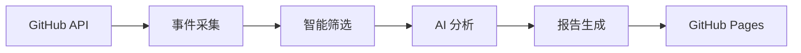

# TrendPulse GitHub 趋势报告

## 欢迎使用 TrendPulse

TrendPulse 是一个智能的 GitHub 趋势分析工具，专注于追踪 **Anthropic Claude 生态系统**的最新动态。

### 核心功能

- 🔍 **智能筛选**: 从海量 GitHub 活动中筛选重要趋势
- 🤖 **AI 分析**: 使用智谱 GLM-4 提取关键信号和洞察
- 📊 **每日报告**: 自动生成结构化的趋势分析报告
- 🎯 **多维度**: 工程实践、研究成果、生态动向

### 📋 监控项目

我们监控以下 **67 个** GitHub 仓库，涵盖 Anthropic 生态系统的核心项目：

#### Anthropic 核心产品

- **[anthropics/claude-code](https://github.com/anthropics/claude-code)** - Claude 代码编辑器
- **[anthropics/skills](https://github.com/anthropics/skills)** - Claude 技能包
- **[anthropics/claude-cookbooks](https://github.com/anthropics/claude-cookbooks)** - Claude 示例
- **[anthropics/claude-quickstarts](https://github.com/anthropics/claude-quickstarts)** - Claude 快速开始
- **[anthropics/courses](https://github.com/anthropics/courses)** - Claude 课程
- **[anthropics/prompt-eng-interactive-tutorial](https://github.com/anthropics/prompt-eng-interactive-tutorial)** - 提示词教程

#### Anthropic SDK & Agent

- **[anthropics/claude-agent-sdk-python](https://github.com/anthropics/claude-agent-sdk-python)** - Python Agent SDK
- **[anthropics/claude-agent-sdk-typescript](https://github.com/anthropics/claude-agent-sdk-typescript)** - TypeScript Agent SDK
- **[anthropics/claude-agent-sdk-demos](https://github.com/anthropics/claude-agent-sdk-demos)** - Agent SDK 示例
- **[anthropics/anthropic-sdk-python](https://github.com/anthropics/anthropic-sdk-python)** - Python SDK
- **[anthropics/anthropic-sdk-typescript](https://github.com/anthropics/anthropic-sdk-typescript)** - TypeScript SDK
- **[anthropics/anthropic-sdk-go](https://github.com/anthropics/anthropic-sdk-go)** - Go SDK
- **[anthropics/anthropic-sdk-java](https://github.com/anthropics/anthropic-sdk-java)** - Java SDK

#### Anthropic 工具与集成

- **[anthropics/claude-code-action](https://github.com/anthropics/claude-code-action)** - GitHub Action
- **[anthropics/claude-code-security-review](https://github.com/anthropics/claude-code-security-review)** - 安全审查
- **[anthropics/claude-plugins-official](https://github.com/anthropics/claude-plugins-official)** - 官方插件
- **[anthropics/devcontainer-features](https://github.com/anthropics/devcontainer-features)** - DevContainer 特性

#### Anthropic 研究与评估

- **[anthropics/evals](https://github.com/anthropics/evals)** - 模型评估
- **[anthropics/political-neutrality-eval](https://github.com/anthropics/political-neutrality-eval)** - 政治中立性评估
- **[anthropics/hh-rlhf](https://github.com/anthropics/hh-rlhf)** - HH-RLHF

#### AI 编程助手

- **[cline/cline](https://github.com/cline/cline)** - Claude AI 编程助手
- **[paul-gauthier/aider](https://github.com/paul-gauthier/aider)** - AI Pair Programming
- **[continuedev/continue](https://github.com/continuedev/continue)** - Continue 开发助手
- **[openai/openai-python](https://github.com/openai/openai-python)** - OpenAI Python SDK
- **[danielmiessler/fabric](https://github.com/danielmiessler/fabric)** - Fabric AI 工具
- **[ErikBjare/gptme](https://github.com/ErikBjare/gptme)** - GPT Me

#### Agent 框架

- **[TransformerOptimus/SuperAGI](https://github.com/TransformerOptimus/SuperAGI)** - SuperAGI
- **[Significant-Gravitas/AutoGPT](https://github.com/Significant-Gravitas/AutoGPT)** - AutoGPT
- **[OpenDevin/OpenDevin](https://github.com/OpenDevin/OpenDevin)** - OpenDevin
- **[langchain-ai/langchain](https://github.com/langchain-ai/langchain)** - LangChain
- **[langgenius/dify](https://github.com/langgenius/dify)** - Dify
- **[run-llama/llama_index](https://github.com/run-llama/llama_index)** - LlamaIndex
- **[microsoft/autogen](https://github.com/microsoft/autogen)** - AutoGen
- **[google-gemini/gemini-cli](https://github.com/google-gemini/gemini-cli)** - Gemini CLI
- **[agentscope-ai/agentscope](https://github.com/agentscope-ai/agentscope)** - AgentScope
- **[agno-agi/agno](https://github.com/agno-agi/agno)** - Agno

### 最新报告

!!! info "最新报告"
    查看 [今日趋势报告](reports/index.md) 了解最新动态。

### 报告分类

| 分类 | 说明 | 示例 |
|------|------|------|
| 🔧 **工程信号** | Claude 工具链、SDK、框架更新 | 新增 API、性能优化 |
| 🔬 **研究信号** | 论文、实验、技术探索 | 新模型、评估方法 |

### 技术架构

### 使用方式

!!! tip "快速开始"
    1. 本地运行: `uv run python scripts/run.py`
    2. 查看报告: 访问 GitHub Pages
    3. 订阅更新: Star 仓库接收通知

---

**📅 报告归档**: 查看 [历史报告](reports/index.md)

**🔗 项目链接**: [GitHub 仓库](https://github.com/gqy20/TrendPluse)
