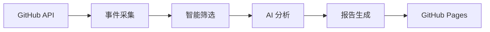

# TrendPulse GitHub 趋势报告

## 欢迎使用 TrendPulse

TrendPulse 是一个智能的 GitHub 趋势分析工具，专注于追踪 **Anthropic Claude 生态系统**的最新动态。

### 核心功能

- 🔍 **智能筛选**: 从海量 GitHub 活动中筛选重要趋势
- 🤖 **AI 分析**: 使用智谱 GLM-4 提取关键信号和洞察
- 📊 **每日报告**: 自动生成结构化的趋势分析报告
- 🎯 **多维度**: 工程实践、研究成果、生态动向

### 最新报告

!!! info "最新报告"
    查看 [今日趋势报告](reports/index.md) 了解最新动态。

### 报告分类

| 分类 | 说明 | 示例 |
|------|------|------|
| 🔧 **工程信号** | Claude 工具链、SDK、框架更新 | 新增 API、性能优化 |
| 🔬 **研究信号** | 论文、实验、技术探索 | 新模型、评估方法 |

### 技术架构

### 使用方式

!!! tip "快速开始"
    1. 本地运行: `uv run python scripts/run.py`
    2. 查看报告: 访问 GitHub Pages
    3. 订阅更新: Star 仓库接收通知

---

**📅 报告归档**: 查看 [历史报告](reports/index.md)

**🔗 项目链接**: [GitHub 仓库](https://github.com/gqy20/TrendPluse)
